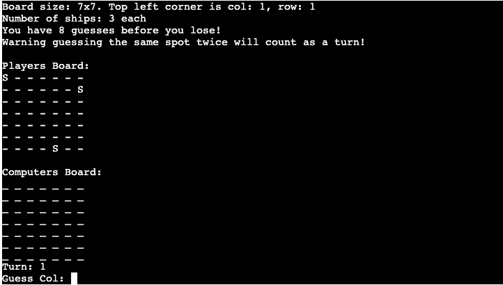
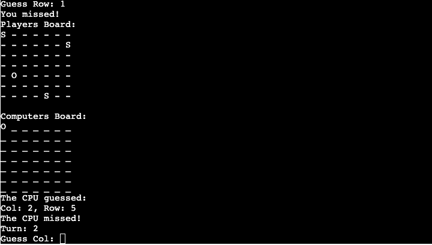

# Battleships

## Introduction

Welcome to my third project. This project is a simple battleships game that uses the python programming language, which runs in the terminal on Heroku.

The user will try to beat the CPU by finding all the battleships first. Each battleship is in a 1x1 spot on the board.

A live version of the game can be found [here](placeholder).

## Strategy

### Project Goals

The main goal of this game is to create a fun entertaining game that is interactive to the user and to display the basic use of the Python language. The user will play against the computer making the game more engaging.

### User Goals:

First Time Visitor Goals
- As a first-time visitor, I want to be engaged with the concept of the game.
- As a first-time visitor, I want to be able to easily understand the rules of the game.
- As a first-time visitor, I want to play the game to win.

Returning Visitor Goals
- As a Returning Visitor, I want to beat the computer.

Frequent User Goals
- As a Frequent User, I want to check to see if there are more features added.

### User Expectations:

The game should be engaging and display a winner and loser.

- The instructions are clear and simple to follow.
- The game is fun to play

## Structure

Below is a diagram showing the logic and possibilities for this game.

## How to play

Battleships is a simple board game that requires 2 players to play. In this case, you will be playing against the CPU.
The user will enter a value between 0-7 to set the guess the location of the ships on the board.
The user gets 3 guesses per ship, if the user has used all guesses on the first ship, the game will end.
The user will see where their ships are marked, indicated an S.
Guess on the opponents board will be marked with an O, hits are indicated by an X.
Once the user has made their guess, the CPU will automatically respond with a guess.
The user and computer will take turn guessing.
The game is finished when either the user or computer has guessed all the opponents ships, or when either player has guessed incorrectly 3 times in a row.

## Features

### Existing Features
- Random ship generation
 - The user and computer ships are generated randomly onto the board.
 - The user's ship location will be printed to the user's board, this is marked with an "S"
 - Multiple battleships - each opponent has 3 ships to guess

- Play against the computer, the computer will automatically return with a guess after the users guess
- Accepts user input

- Input validation
    - You can only enter numbers/integers
    - If you enter a value that is not in range it will count as a turn
    - If you enter the same coordinates twice, this counts as a turn
### Future Features
 - Allow player to set grid
 - Allow player to position the ships themselves
## Testing

I have manually tested this project by the following:
- Entered incorrect inputs into the terminal to make sure the correct warning messages are appearing
- During the coding process I ran the project through the terminal each time to make sure the function im creating is working
- Tested the project on Heroku
### Bugs
#### Solved Bugs
- Trying to guess the values of row: 7, col: 7 was returning a value not in range error. This was rectified by - 1 to the guessing logic.
- The turn counter started at 0. This was rectified by adding + 1 to the turn counter.

### Remaining Bugs
- No bugs remaining
### Validator Testing
- [PEP8](http://pep8online.com/)
I Ran the code through PEP8 validator. I initially ran into a few issues, as you can see in the image below:

However, these issues were rectified by adding white spaces around operators and starting new lines of code as the line was too long. 
## Deployment
I used Heroku to deploy my final project to the cloud. To do this I had to:

1. Push all latest code to GitHub.
2. Go to [Heroku](https://dashboard.heroku.com/apps)
3. Select new in the top right corner.
4. Create new app.
5. Enter the app name and select Europe as the region.
6. Connect to GitHub.
7. Search for repo-name.
8. Select connect to the relevant repo you want to deploy.
9. Select the settings tab.
10. Add buildpack
11. Select Python, then save changes.
12. Select Nodejs, then save changes.
13. Make sure heroku/python is at the top of the list, followed by heroku/nodejs
14. Navigate to the deploy tab
15. Scroll down to Manual Deploy and select deploy branch.
## End Product

Please find below some screenshots of the finished project:

User misses shot:

Computer misses shot:

User sunk first CPU ship:

Too many incorrect guesses:

## Credits